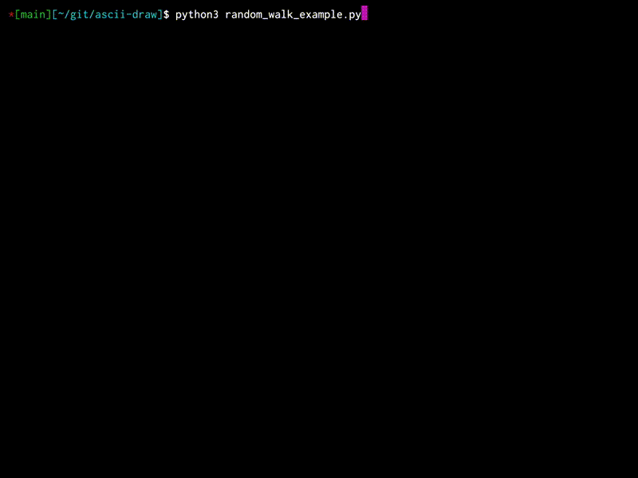

# ASCII Draw

A simple package for drawing ASCII on canvas, using Python.


## Examples:

### Random Walk:
```python
# Starting random walk and canvas drawing
# For each timestep, rendering a blank canvas
# rendering each particle and updating its position

canvas = Canvas(size=(30,100))
for _ in range(50):
    canvas.render_canvas()
    for particle in particles:
        canvas.render_point(
            y=particle.y,
            x=particle.x,
            char=particle.char,
            color=particle.color
            )
        particle.update_position()
    canvas.update_screen() 
    time.sleep(0.1)
```
